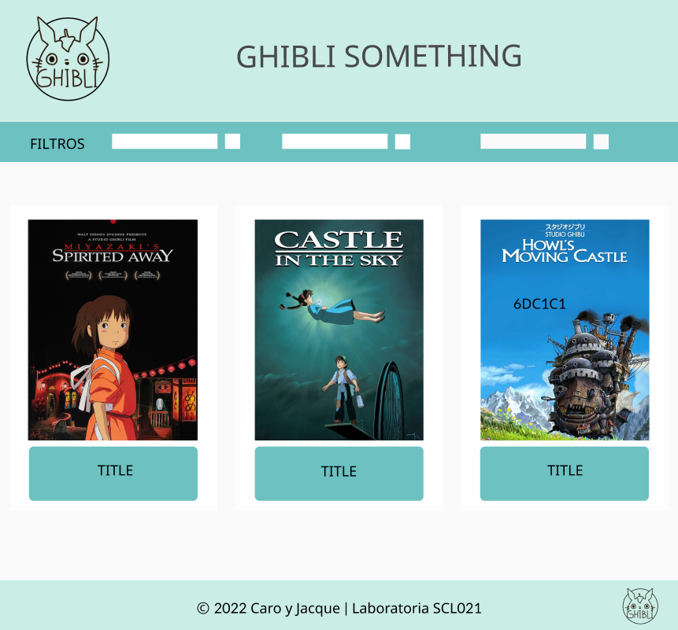

## Índice 

* 1. [About our page](#about-our-page-seedling)
* 2. [Historias de Usuario](#historias-de-usuario-bookmark_tabs)
* 3. [Prototipo de Baja Fidelidad](#prototipo-de-baja-fidelidad-hammer_and_wrench)
* 4. [Prototipo de Alta Fidelidad](#prototipo-de-alta-fidelidad-computer)
* 5. [Producto Final](#producto-final-sparkles) 

***

  
## About Our Page :seedling: 

Studio Ghibli es un estudio japonés de animación el cuál ha producido y entregado al mundo del cine varios éxitos de taquilla aclamados por la crítica, dentro de sus películas más exitosas se encuentran "El viaje de Chihiro", "El cuento de la Princesa Kaguya", "Mi vecino Totoro", entre otros.

Las historias relatadas en sus obras son bastante variadas, captando así la atención de una amplia gama de usuarios, desde niños a adultos.
Nuestra misión es llegar a este variado público y presentarles una página amigable con la cuál puedan interactuar fácilmente 

Nuestra página está dedicada a las personas que están comenzando a adentrarse en el mundo de Ghibli, usuarios que están ansiosos por conocer más sobre las obras producidas en el estudio, incluyendo descripciones, personajes, años de lanzamiento y demás.

En orden de hacer la página más amigable, instalamos una tabla de filtros en donde se puede filtrar por orden alfabético, cronológico, director, productor y puntaje.

Al pasar el puntero sobre un título se podrá hacer click para desplegar más información sobre este, dentro de la ventana se podrá elegir entre personajes, ubicaciones y vehiculos.

  
## Historias de Usuario :bookmark_tabs:

1. A mi como fan de studio ghibli me gustaría poder ver un listado de películas:
   - [x] Crear HTML base
   - [x] Crear CSS base
   - [x] Extraer data
   - [x] Mostrar, darle formato y diseño a la data

3. A mi como fan de studio ghibli me gustaría poder filtrar y ordenar las películas:
   - [x] Añadir barra de Filtros
   - [x] Ordenar alfabeticamente
   - [x] Ordenar por año de estreno
   - [x] Filtrar por Director
   - [x] Filtrar por Productor
   - [x] Ordenar por puntaje de Rotten Tomatoes

4. A mi como fan de studio ghibli me gustaría ver más información de las películas:
   - [x] Crear ventana modal
   - [x] Darle diseño a la ventana modal
   - [x] Mostrar personajes
   - [x] Mostrar directores
   - [x] Mostrar productores
   - [x] Mostrar ubicaciones
   - [x] Mostrar resúmen
   - [ ] Añadir información extra: OST
   - [ ] Añadir información extra: Premios y/o postulaciones
   - [ ] Añadir información extra: Datos curiosos

## Prototipo de Baja Fidelidad :hammer_and_wrench:

## Prototipo de Alta Fidelidad :computer:

## Producto Final :sparkles:
Puedes ver nuestro proyecto final [aquí](https://carolinafuenzalida.github.io/SCL021-data-lovers/src/index.html) o [aquí](https://jackiiem.github.io/SCL021-data-lovers/src/index.html).

